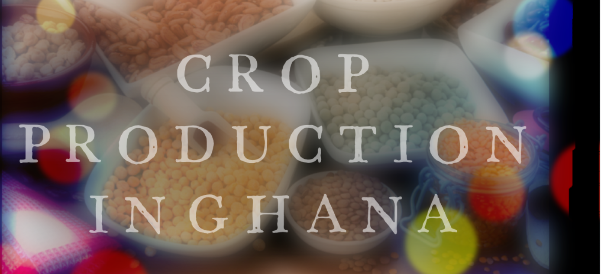

#### [Project Document in Ipython Notebook](https://github.com/Swintabel/GHANA-CROP-PRODUCTION/blob/main/CROP%20PRODUCTION.ipynb)
#### [Tableau Dashboard](https://public.tableau.com/views/GHANACROPPRODUCTIONDASHBOARD/CROPPRODUCTIONDASHBOARD?:language=en-US&:display_count=n&:origin=viz_share_link)

### 1.1 Problem Statement 

The dataset provided contains information about various types of crops and the yield per year in specific regions in Ghana. Other vital information such as rainfall patterns as well as national wholesale prices for the crops. This data is to help us come up with insights that can inform us on the outcome of yield and production for each crop in a specified year. Also, we want to be able to predict crop yield in the next couple of years.

### 1.2 Hypothesis 

It is possible to predict the crop yield using a predictive model. The hypothesis to be considered is that crop yield can be estimated based on a couple of factors such as area of land and rainfall patterns.

### 1.3 Project Goal 

In this project, we will seek to achieve 2 main goals and they are;

* Segment dataset and draw unique insights, including visualization of the yield volume and assessing the effect of any outliers.
* Explore correlation between other parameters(rainfall, area) and yield and finally build a regression model based on the generated findings. 

